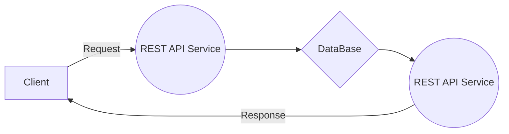

# Welcome to Sport House!

The Sport House project was created with the support of the State Innovation Promotion Fund. Designed for the entire population of the Russian Federation in the field of sports.

## Target

The goal of R&D is to maximize the pace of digital transformation in the field of physical culture and sports.
The main scientific and technical problems that the R&D implementation solves are:

 - Development and implementation of artificial intelligence technologies in the field of sports
 - Development and implementation of specialized neural network algorithms for depreciation analysis and accounting for the quality of sports equipment
 - Creation of a unified system for planning sports events and reporting
 - Automate the intelligent search for sporting events and venues

## Stack

       

## Interaction scheme
Scheme of interaction between the client part and the API:

